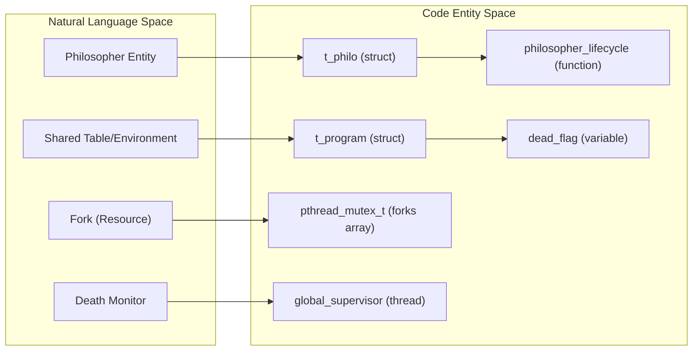
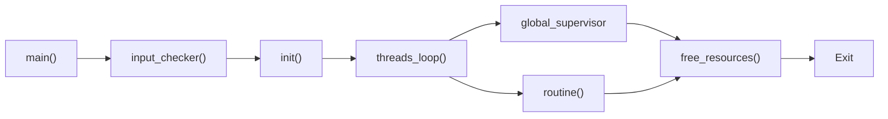

# Overview
Relevant source files
- [Makefile](https://github.com/Igbescobar/Philosophers/blob/a53c8c75/Makefile)
- [README.md](https://github.com/Igbescobar/Philosophers/blob/a53c8c75/README.md?plain=1)
- [src/main.c](https://github.com/Igbescobar/Philosophers/blob/a53c8c75/src/main.c)

The **Philosophers** project is a simulation of the classic Dining Philosophers problem, designed to explore the fundamentals of concurrent programming, thread synchronization, and resource management in C. The simulation involves a set of philosophers sitting at a round table with a bowl of spaghetti and a single fork between each pair. Philosophers must alternate between eating, sleeping, and thinking while avoiding starvation and deadlocks.

## Simulation Mechanics

The program simulates multiple concurrent entities (philosophers) using `pthread` threads. To eat, a philosopher must acquire two forks (represented by `pthread_mutex_t` locks). The simulation ends if a philosopher dies of starvation or if all philosophers have eaten a required number of times.

### System Architecture: Logic to Code Mapping

The following diagram illustrates how the conceptual components of the simulation map to specific data structures and functions within the codebase.

**Component Mapping Diagram**

**Sources:**[src/main.c16-31](https://github.com/Igbescobar/Philosophers/blob/a53c8c75/src/main.c#L16-L31)[includes/philo.h55-87](https://github.com/Igbescobar/Philosophers/blob/a53c8c75/includes/philo.h#L55-L87)

---

## Build & Execution

The project uses a `Makefile` to manage compilation. The resulting executable, `philo`, accepts specific timing and count parameters to control the simulation behavior.

| Step | Command | Description |
| --- | --- | --- |
| **Compile** | `make` | Compiles source files into the `philo` binary using `cc` with `-Wall -Wextra -Werror`. |
| **Run** | `./philo [n] [die] [eat] [sleep] [limit]` | Starts the simulation with the specified parameters. |
| **Clean** | `make fclean` | Removes object files and the executable. |

For a detailed breakdown of argument ranges and usage examples, see **[Getting Started: Build & Usage](/Igbescobar/Philosophers/1.1-getting-started:-build-and-usage)**.

**Sources:**[Makefile16-30](https://github.com/Igbescobar/Philosophers/blob/a53c8c75/Makefile#L16-L30)[src/main.c20-25](https://github.com/Igbescobar/Philosophers/blob/a53c8c75/src/main.c#L20-L25)

---

## Execution Lifecycle

The program follows a strict initialization and execution sequence managed in `main.c`[src/main.c16-31](https://github.com/Igbescobar/Philosophers/blob/a53c8c75/src/main.c#L16-L31)

**Lifecycle Flowchart**

1. **Validation**: The program first verifies the number of arguments and validates that they are positive integers via `input_checker`[src/main.c20-23](https://github.com/Igbescobar/Philosophers/blob/a53c8c75/src/main.c#L20-L23)
2. **Initialization**: The `init` function allocates memory for philosophers and forks, and initializes all required mutexes [src/main.c24-25](https://github.com/Igbescobar/Philosophers/blob/a53c8c75/src/main.c#L24-L25)
3. **Simulation**: `threads_loop` spawns the philosopher threads and a supervisor thread that monitors for death conditions [src/main.c27](https://github.com/Igbescobar/Philosophers/blob/a53c8c75/src/main.c#L27-L27)
4. **Teardown**: Once the simulation concludes, `free_resources` ensures all mutexes are destroyed and heap memory is released [src/main.c29](https://github.com/Igbescobar/Philosophers/blob/a53c8c75/src/main.c#L29-L29)

For a line-by-line walkthrough of the entry point, see **[Program Entry Point & Lifecycle](/Igbescobar/Philosophers/1.2-program-entry-point-and-lifecycle)**.

**Sources:**[src/main.c16-31](https://github.com/Igbescobar/Philosophers/blob/a53c8c75/src/main.c#L16-L31)
